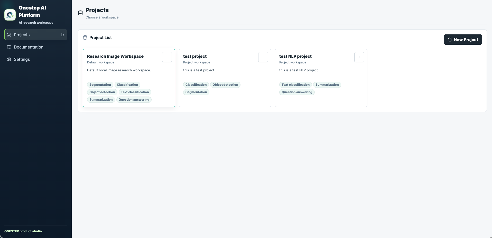
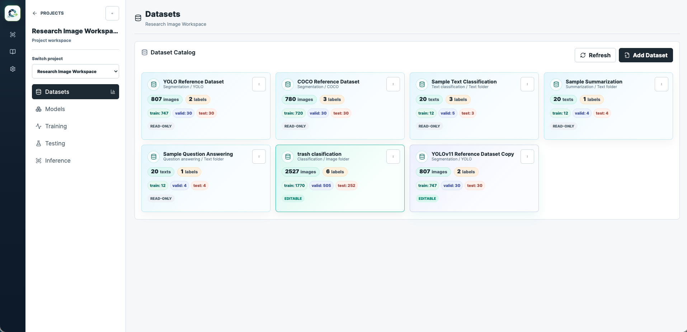
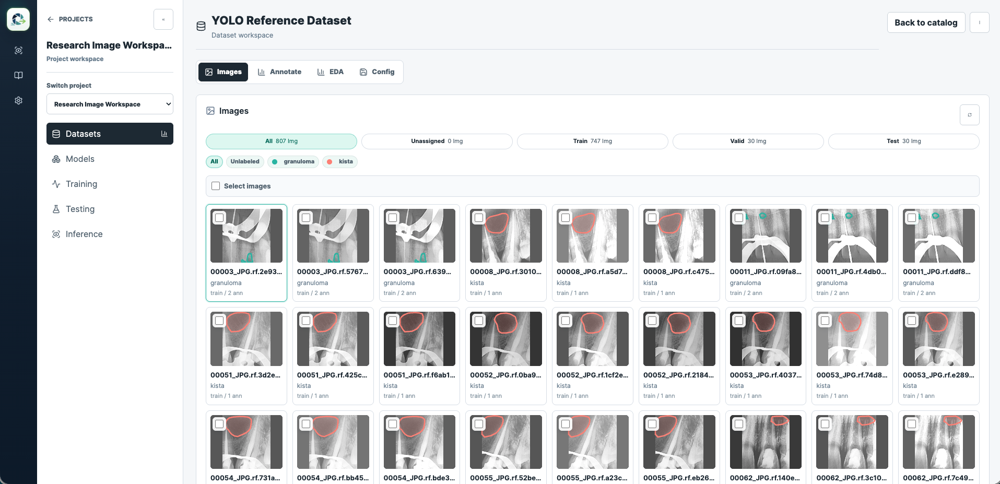
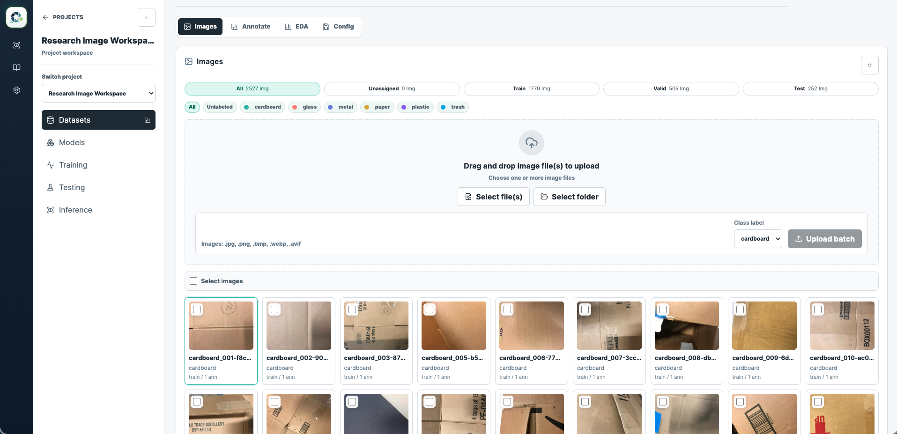
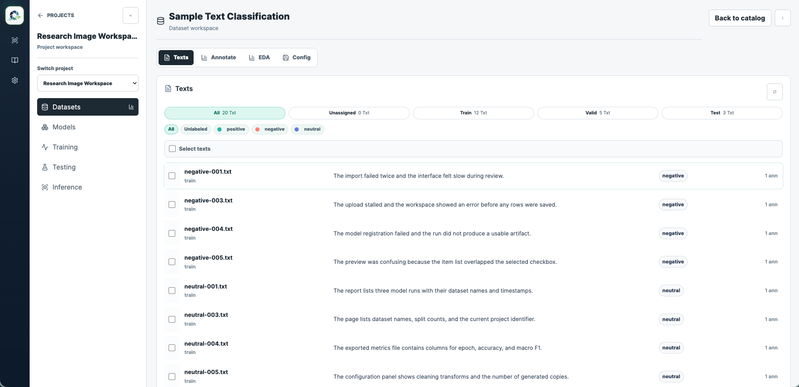
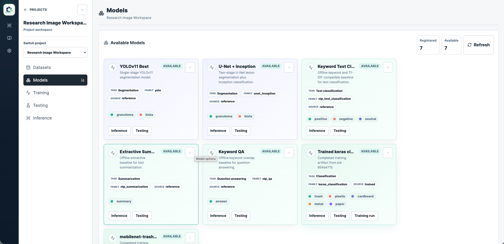
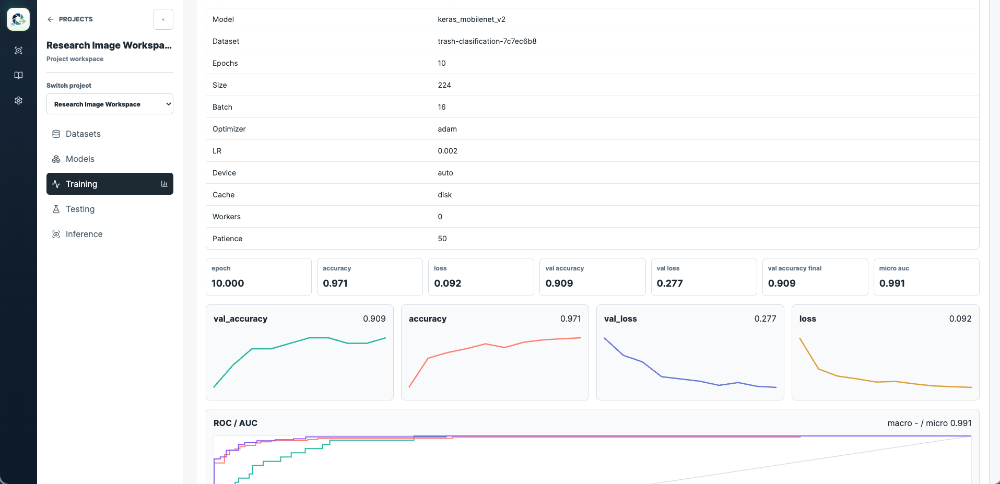
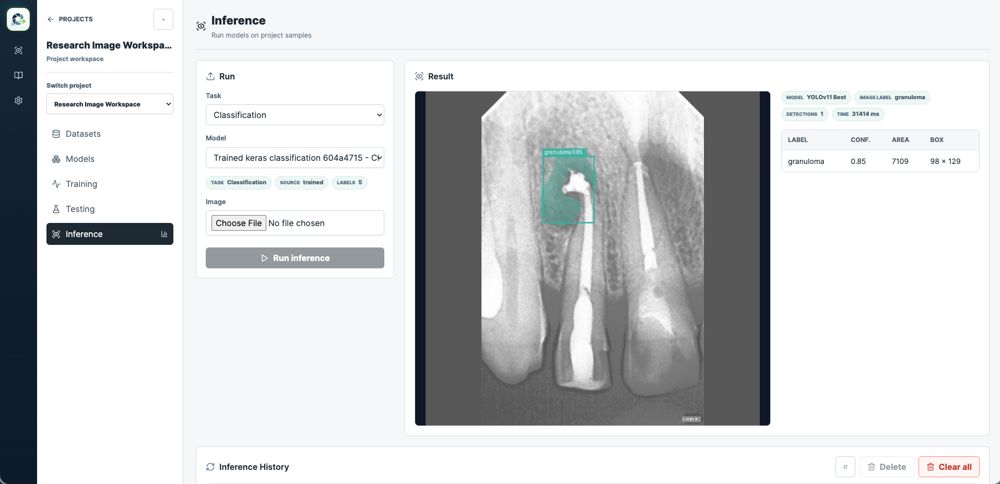
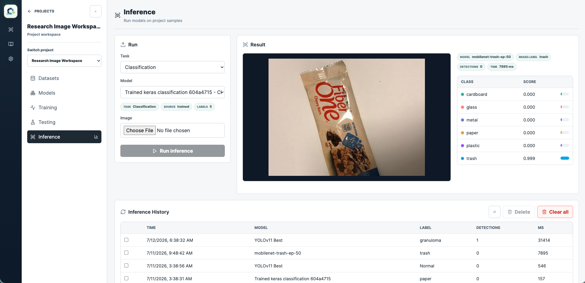

<div align="center">
  
</div>

# Orinth


[](https://github.com/Onestep-AI-Labs/orinth/actions/workflows/backend.yml)
[](https://github.com/Onestep-AI-Labs/orinth/actions/workflows/frontend.yml)

**One workspace for Computer Vision, NLP, and LLM intelligence.**

Orinth is a local studio where teams can turn image and text datasets into usable model experiments through labeling, preparation, training, testing, and inspection — and fine-tune, serve, and chat with language models in the same place. Built for research and engineering workflows, it helps teams move from raw images and text to measurable model behavior without implying autonomous clinical diagnosis or final decision-making.

## Workflow Pillars

### Organize
Create projects and datasets that keep image and text work scoped and understandable.



### Prepare
Upload, label, annotate, split, preprocess, and version datasets without rewriting originals. Dataset Studio supports both computer vision and NLP formats, imports from the Hugging Face Hub, and data recipes that build datasets from your own documents.





### Train
Run task-compatible training jobs from prepared datasets, utilizing the local Models Zoo — including LoRA/QLoRA/full LLM fine-tuning.



### Test
Compare model behavior with task-aware metrics and per-item inspection.


### Inspect
Keep model outputs, history, and dataset health visible for repeated iteration across all inference tasks.



### Serve & Chat
Fine-tune a language model, export it to GGUF, serve it locally, and chat with sampler controls, web search, and a reasoning view.


### Learn as you go
Guided in-app tours (built on [react-joyride](https://react-joyride.com/)) walk through every main surface, with a first-run welcome walkthrough on the Projects page.

The repository keeps existing research assets local-only:

- `datasets/`
- `models/`
- `notebooks/`

The app source lives in `backend/` and `frontend/`.

## Tech Stack

- **Backend**: FastAPI, SQLAlchemy, SQLite
- **Machine Learning**: PyTorch, TensorFlow/Keras, Hugging Face Transformers, Ultralytics YOLO, Scikit-Learn
- **Frontend**: Next.js, React, Tailwind CSS, pnpm
- **Desktop**: Tauri (Rust), packaged as a macOS `.dmg`

## Architecture

The backend is a FastAPI app with domain routers and service packages:

- App entrypoint: `backend/app/main.py`
- Shared service container: `backend/app/container.py`
- API router aggregator: `backend/app/api/routes.py`
- Domain routers: `backend/app/api/routers/`
- API serializers: `backend/app/api/serializers.py`
- Schemas: `backend/app/schemas.py`
- DB models: `backend/app/db/models.py`
- ML registry and predictors: `backend/app/ml/`
- Services: `backend/app/services/`
- Training runners: `backend/app/training/runners/`

The frontend is a Next.js app with route entrypoints, feature modules, and a domain-based API client:

- App routes: `frontend/app/`
- App shell: `frontend/components/app-shell.tsx`
- Page export barrel: `frontend/components/platform-pages.tsx`
- Feature modules: `frontend/features/`
- API client package: `frontend/lib/api/`
- API types: `frontend/types/api.ts`
- Global base styles: `frontend/app/globals.css`
- Platform styles: `frontend/app/styles/platform.css`

The macOS desktop app under `desktop/` wraps both servers rather than
reimplementing them — see [Desktop App](#desktop-app-macos).

## Quickstart

1. Copy the environment templates and adjust as needed (see
   [Environment Variables](#environment-variables)):

   ```bash
   cp .env.example .env
   cp frontend/.env.example frontend/.env.local
   ```

2. Verify local prerequisites (`uv`, `pnpm`, Python 3.11, Node):

   ```bash
   make doctor
   ```

3. Install dependencies once (see [Backend](#backend) and
   [Frontend](#frontend) below), then start both servers together:

   ```bash
   make dev
   ```

   This starts the backend on `http://localhost:8000` and the frontend on
   `http://localhost:3000` together, with interleaved logs in one terminal.
   `make dev` fails fast if port 8000 or 3000 is already in use, and Ctrl-C
   cleanly stops both processes (no orphaned `uvicorn`/`next` processes left
   behind).

4. Before committing, run every documented quality gate in one shot:

   ```bash
   make check
   ```

   `check` runs backend lint (`ruff`) and the fast backend test suite, then
   frontend `typecheck`, `lint`, and `build`, and stops at the first failing
   gate. The individual targets (`make lint-backend`, `make test`,
   `make typecheck`, `make lint`, `make build`) are also available on their
   own.

## Backend

```bash
cd backend
uv venv --python 3.11
source .venv/bin/activate
uv sync
uv run uvicorn app.main:app --reload --host 0.0.0.0 --port 8000
```

Backend API docs will be available at `http://localhost:8000/docs`.

Backend validation:

```bash
cd backend && uv run pytest
```

## Frontend

```bash
cd frontend
pnpm install
pnpm dev
```

Frontend will be available at `http://localhost:3000`.

Frontend validation:

```bash
cd frontend && pnpm typecheck
cd frontend && pnpm lint
cd frontend && pnpm build
```

## Desktop App (macOS)

`desktop/` packages the platform as an installable macOS app. Drag
**Orinth.app** to `/Applications`, double-click, and the full app
opens in a native window — no terminal and no `make dev`.

```bash
make desktop
```

Output: `desktop/src-tauri/target/universal-apple-darwin/release/bundle/dmg/Orinth_<version>_universal.dmg` (~56 MB).

The bundle is **universal** — one `.dmg` for both Apple silicon and Intel Macs.
Hand [`desktop/INSTALL.md`](desktop/INSTALL.md) to anyone you send it to; it
covers the Gatekeeper prompt an unsigned app triggers on a machine that did not
build it.

The app is a supervisor around the same FastAPI and Next.js servers `make dev`
runs, so there is no separate implementation to keep in sync. Because the
`.dmg` ships source rather than runtimes, **first launch downloads and installs
the ~2.7 GB ML environment** (10–20 minutes, needs a network connection) with
per-step progress on screen; later launches start in seconds. Everything the
app generates lives in `~/Library/Application Support/orinth.ai.studio/`,
never in the repo checkout.

The bundle is ad-hoc signed but not notarized, so the first launch on another
machine needs one manual approval (see `INSTALL.md`). Details, troubleshooting,
and known limitations:
[`desktop/README.md`](desktop/README.md); design rationale:
[`specs/phase-18-macos-desktop-app.md`](specs/phase-18-macos-desktop-app.md).

## Environment Variables

Copy `.env.example` to `.env` in the repo root for backend settings, and
`frontend/.env.example` to `frontend/.env.local` for frontend settings.

Root `.env.example` (backend):

- `MODELS_DIR`, `DATASETS_DIR`, `STORAGE_DIR` — local paths for reference
  assets and generated runtime artifacts.
- `DATABASE_URL` — SQLite connection string.
- `BACKEND_CORS_ORIGINS` — origins allowed to call the API directly; defaults
  to the frontend dev origin (`http://localhost:3000`).
- `HUGGINGFACE_HUB_TOKEN` (alias `HF_TOKEN`) — only needed for private or
  gated Hugging Face models.

`frontend/.env.example` (the proxy-vs-direct URL model):

- `BACKEND_PROXY_ORIGIN` — where the Next.js dev server proxies `/api/*` and
  `/media/*` requests; defaults to `http://127.0.0.1:8000`. This is what
  `make dev` and `pnpm dev` use, and it matches the backend's default port.
- `NEXT_PUBLIC_BACKEND_URL` — leave unset to reach the backend through the
  frontend origin via the proxy above (the normal local setup). Set it only
  when intentionally exposing the backend at a separate public URL, in
  which case the frontend calls that URL directly instead of proxying.

## Phases

Phase 1 includes inference for both available local model families:

- YOLOv11 segmentation: `models/yolo_11_best/weights/best.pt`
- U-Net + Inception: `models/unet_inception/best_unet_model.keras` and `best_classifier_inception.keras`

Phase 2 adds dataset testing jobs and metrics dashboards.

Phase 3 adds subprocess-based training jobs and model promotion.

Phase 4 & 5 covers Dataset Studio and Image Platform MVP features.

Phase 6 introduces comprehensive Natural Language Processing (NLP) task pipelines, extending the workspace to support text classification, summarization, and question answering.

Phase 7 & 8 revamp the frontend UI and formalize the design system.

Phase 9 adds the entry flow and project settings.

Phase 10 adds Hugging Face Hub dataset import (the Dataset Hub).

Phase 11 adds Data Recipes — generating datasets from source documents, with optional LLM assistance.

Phase 12 adds custom model upload into the registry.

Phase 13 adds advanced training settings and device detection.

Phase 14 adds LLM fine-tuning (LoRA, QLoRA, full, and continued pretraining).

Phase 15 adds LLM serving, GGUF export, and the interactive chat surface.

Phase 16 adds guided tours across the platform surfaces.

Phase 17 adds the Model Architecture Studio — a visual graph editor with Keras and PyTorch emitters.

Phase 18 packages the platform as a macOS desktop app (`.dmg`); see [Desktop App](#desktop-app-macos).

Phase 19 rebrands the product to **Orinth**, makes sign-in the entry route, and removes the marketing landing page and the in-app documentation surface.

## AI Workflow

Project AI guidance is shared across Codex and Claude Code:

- Codex entrypoint: `AGENTS.md`
- Claude Code entrypoint: `CLAUDE.md`
- Local skill: `.agents/skills/orinth`
- Workflow and rules: `docs/ai/`
- Planning and execution references: `specs/`

## ToDo

- [x] refine NLP transformer fine-tuning
- [x] LLM task pipeline (fine-tuning, serving, GGUF export, chat)
- [x] auto data prep (data recipes)
- [ ] planning to add jupyter notebook for custom model with sandbox env (isolation)

## License

This software is released as Open Source Software (OSS) under the [Apache 2.0 License](LICENSE).
